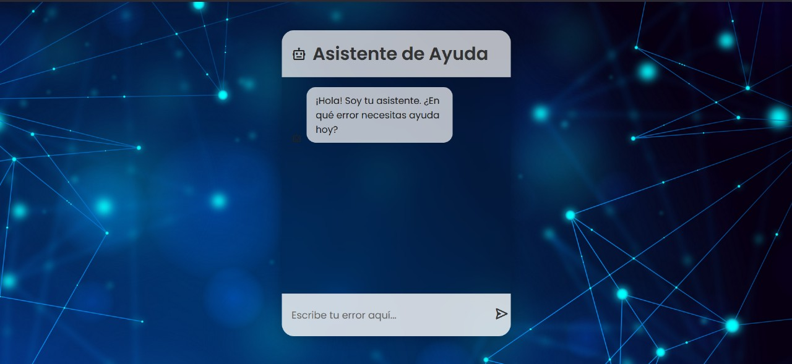

# 🤖 Chatbot API experto en Python



Este proyecto es una API REST desarrollada con **FastAPI**, que funciona como un **chatbot especializado en detectar y resolver errores comunes de programación**.  
Su funcionamiento se basa en el modelo **Mistral**, accedido mediante **OpenRouter** (compatible con la API de OpenAI), lo que permite generar respuestas conversacionales claras, útiles y enfocadas en soluciones reales para problemas de código.

El asistente está entrenado para interpretar errores típicos en lenguajes como **Python, JavaScript, HTML, CSS, Java y C/C++**, explicarlos de forma sencilla y ofrecer correcciones concretas, con ejemplos antes y después.  

Además, se ha configurado **CORS** para permitir el consumo de esta API desde aplicaciones front-end o entornos externos sin restricciones de origen.


---

## 🚀 Requisitos

- Python 3.8 o superior  
- Tener una API Key de [OpenRouter](https://openrouter.ai)  
- Conexión a internet  

---

## 🛠 Instalación

1. Clona este repositorio o descarga los archivos:

```bash
git clone https://github.com/tu_usuario/tu_repositorio.git
cd chatbot-ia_python
```

2. Crea un entorno virtual:

```bash
python -m venv venv
```

3. Activa el entorno virtual:

- Windows:
```bash
venv\Scripts\activate
```
- macOS/Linux:
```bash
source venv/bin/activate
```

4. Instala las dependencias:

```bash
pip install -r requirements.txt
```

5. Crea un archivo `.env` en la raíz del proyecto con el siguiente contenido:

```env
API_KEY=tu_api_key_de_openrouter
BASE_URL=https://openrouter.ai/api/v1
```

---

## ▶ Ejecución

Inicia el servidor con:

```bash
uvicorn main:app --reload
```

- API disponible en: [http://127.0.0.1:8000](http://127.0.0.1:8000)  
- Documentación Swagger UI: [http://127.0.0.1:8000/docs](http://127.0.0.1:8000/docs)  

---

## 📬 Ejemplo de uso

Petición POST a `/chat`:

```json
{
  "pregunta": "¿Qué es una lista en Python?"
}
```

Respuesta esperada:

```json
{
  "respuesta": "Una lista en Python es una colección ordenada y mutable de elementos..."
}
```

---

## 🐳 Despliegue con Docker

1. Construye la imagen:

```bash
docker build -t python-chatbot .
```

2. Ejecuta el contenedor:

```bash
docker run -d -p 8000:8000 --name chatbot --env-file .env python-chatbot
```

---

## ☁️ Despliegue en Render

1. Crea un nuevo **Web Service** en [Render](https://render.com)  
2. Conecta tu repositorio GitHub  
3. Configura las variables de entorno (`.env`)  
4. Usa este comando de inicio:

```bash
uvicorn main:app --host 0.0.0.0 --port 8000
```

---

## 📁 Estructura del proyecto

```
chatbot-ia_python/
├── main.py           # API con FastAPI
├── config.py         # Contiene el PROMPT_SISTEMA
├── .env              # Variables de entorno
├── requirements.txt  # Dependencias
├── Dockerfile        # Configuración para Docker
└── README.md         # Documentación del proyecto
```

---

## 👨‍💻 Autores

Proyecto originalmente desarrollado por **Ing. Cristian Díaz**  
Modificado y mejorado por:

- 👩‍💻 Pamela Galvis  
- 👨‍💻 Manuel Galvis  
